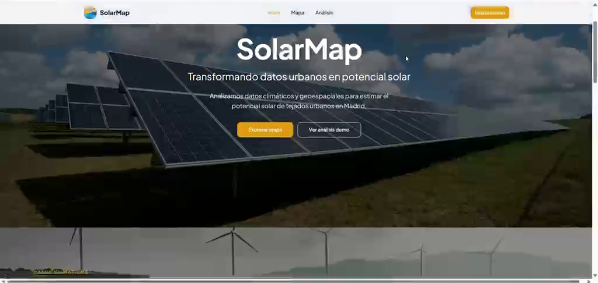
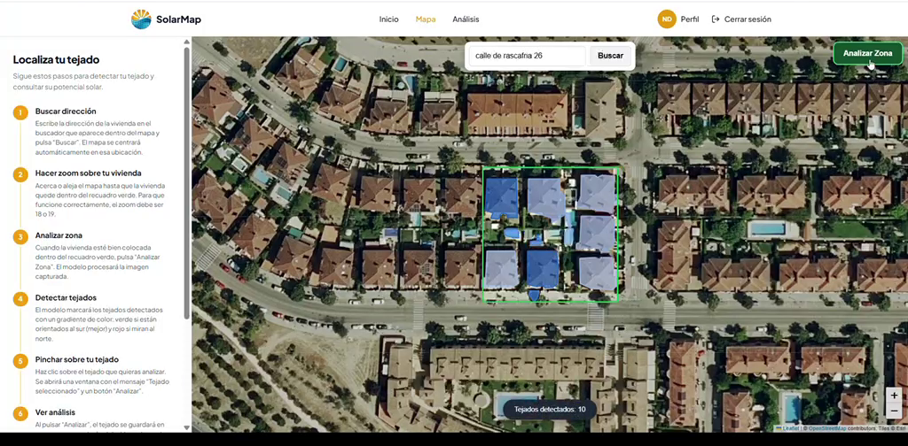
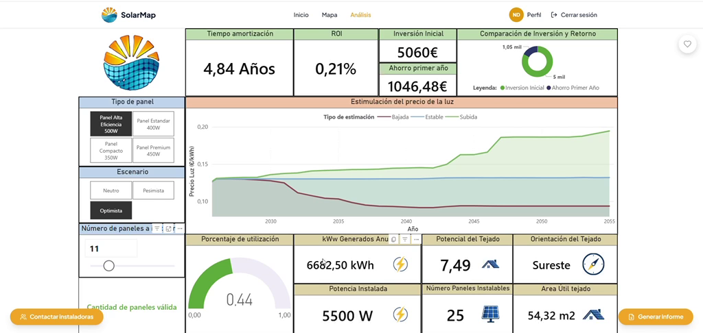

# SolarMap

**Estimación del potencial solar de tejados combinando imágenes aéreas, deep learning y datos climáticos.**

SolarMap permite introducir una dirección, detecta automáticamente los tejados de la zona mediante un modelo de segmentación semántica (U-Net) y estima su potencial para instalar paneles solares a partir de su superficie, su orientación y datos de radiación solar.

Proyecto universitario desarrollado en equipo (5 personas) en el Grado en Ingeniería Matemática Aplicada al Análisis de Datos (UEM), asignaturas de Big Data.



---

## Cómo funciona

```
Dirección ─► Geocodificación ─► Imagen aérea ─► U-Net (segmentación de tejados)
                                                        │
                                                        ▼
                         Polígonos GeoJSON (área m², orientación, ángulo)
                                                        │
             Datos climáticos (ERA5) + precio de la luz ─┤
                                                        ▼
                     MySQL ─► API (FastAPI) ─► Web (React) + dashboards Power BI
```

## Modelo de detección de tejados (U-Net)

| | |
|---|---|
| Tarea | Segmentación semántica binaria (tejado / no tejado) |
| Arquitectura | U-Net implementada desde cero en PyTorch (4 niveles, 32→512 filtros, BatchNorm) |
| Datos | ~3.400 imágenes aéreas de 256×256 px con máscaras, divididas en train / validación / test |
| Entrenamiento | 30 épocas · Adam (lr = 1e-3) · `BCEWithLogitsLoss` con `pos_weight` para compensar el desbalance de clases · guardado del mejor modelo según la pérdida de validación |
| Postprocesado | Umbral ajustado mediante un análisis de thresholds · OpenCV para extraer contornos, filtrar ruido y convertir las máscaras en polígonos GeoJSON con área real (m²) y orientación |



*Tejados detectados automáticamente por la U-Net en la zona seleccionada.*

**Resultados en el conjunto de test**

| IoU | Dice | Accuracy | Precision | Recall |
|:---:|:---:|:---:|:---:|:---:|
| 0,67 | 0,80 | 93 % | 78 % | 82 % |

El modelo se sirve mediante una API REST (FastAPI, endpoint `/detect-roofs`). La web la llama para detectar los tejados de la dirección introducida y guardarlos en la base de datos.

### Análisis de rentabilidad

Para cada tejado seleccionado, la aplicación estima la producción anual, la inversión, el ahorro, el tiempo de amortización y la evolución del precio de la luz según distintos escenarios.



## Tecnologías

- **IA / datos:** Python · PyTorch · NumPy · Pandas · OpenCV · Jupyter
- **Datos externos:** Copernicus / ERA5 (clima) · ortofotos aéreas
- **Backend:** FastAPI · MySQL · HDFS (data lake *bronze/silver*)
- **Frontend:** React · TypeScript · Vite · Tailwind CSS · mapas interactivos
- **BI:** Power BI (dashboards integrados en la web)
- **Despliegue:** Docker · Docker Compose · Nginx

## Estructura

```
src/
├── Mapa y Modelo Tejados/
│   ├── entrenamiento/      # Notebook: dataset, U-Net, entrenamiento y evaluación
│   ├── modelo_web/         # Inferencia y conversión de máscaras a GeoJSON
│   ├── api/                # API FastAPI del modelo
│   └── mapa/               # Mapa interactivo
├── Ingesta y Almacenamiento/  # ETL de clima, precio de la luz y tejados → MySQL
├── Prediccion Luz/            # EDA y predicción del precio de la luz
└── API Web/                   # API principal de la web
frontend/                      # Aplicación web (React + TypeScript)
docker/ · docker-compose.yml   # Contenedores de todos los servicios
```

## Ejecución

**Con Docker (todos los servicios):**

```bash
docker compose up --build
```

**En local (modelo + web), en Windows:**

```bash
python -m venv .venv
.venv\Scripts\activate
pip install -r requirements.txt
cd frontend/solarmapuem-main && npm install
```

Después, ejecutar `arrancar_solarmap.bat` desde la raíz del proyecto.

## Mi aportación

Fui la responsable del **modelo de detección de tejados**, de principio a fin:

- Búsqueda y preparación del dataset de imágenes aéreas y máscaras.
- Diseño e implementación de la U-Net en PyTorch, entrenamiento, ajuste iterativo y evaluación (IoU, Dice, precision, recall, análisis de umbrales).
- Postprocesado de las predicciones a polígonos GeoJSON con superficie y orientación de cada tejado.
- **Integración del modelo en la web:** API de inferencia, guardado de los tejados detectados en la base de datos y despliegue con Docker.

## Equipo

Proyecto desarrollado junto a Sergio Gama, Eva Nieto, Javier Mohíno y Guillermo Angulo.
